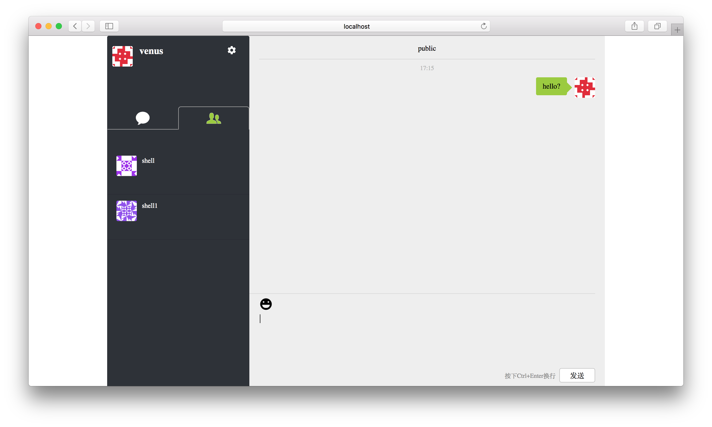
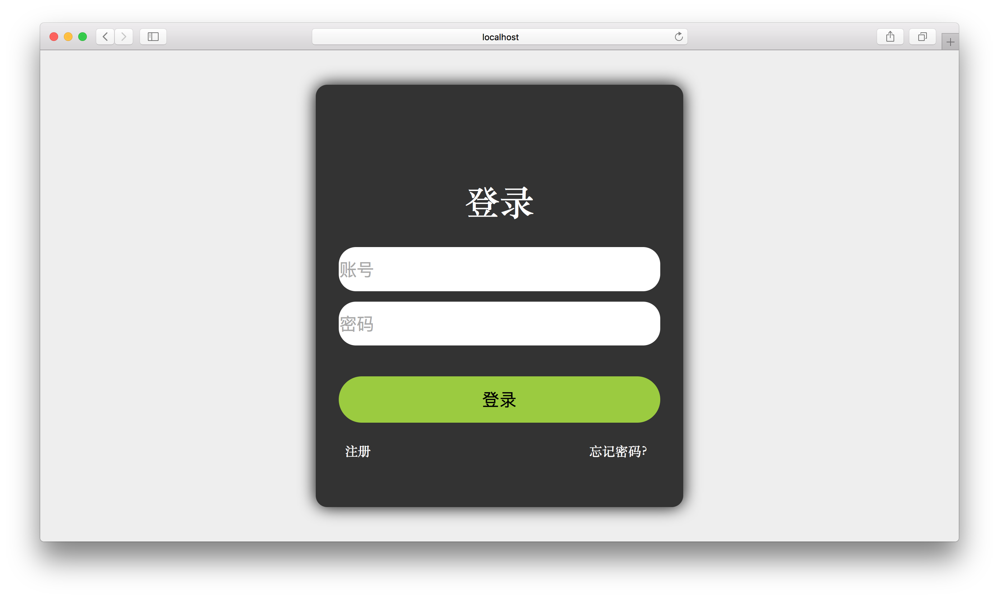

# VChat

VChat，一款即时通讯 Web 应用，低仿微信。

**还在开发中...（WIP...）**

## 文件结构

```bash
.
├── LICENSE
├── README.md
├── client                  # 客户端，React、Redux、React-Router、Styled-Component 构建
│   ├── README.md             # 客户端文档
│   ├── package.json          # 依赖包
│   ├── public                # public files
│   ├── src                   # source code
│   └── yarn.lock             # yarn.lock
└── server                  # 服务器端，Koa、MongoDB、Socket.io 构建
    ├── README.md             # 服务器端文档
    ├── app.js                # 服务器人口
    ├── constants.js          # 常量
    ├── helper                # helper
    ├── models                # MongoDB Collection 模型
    ├── package.json          # 依赖包
    └── routers               # Koa-router
```

## 预览

|||
|:--|:--|
|||
